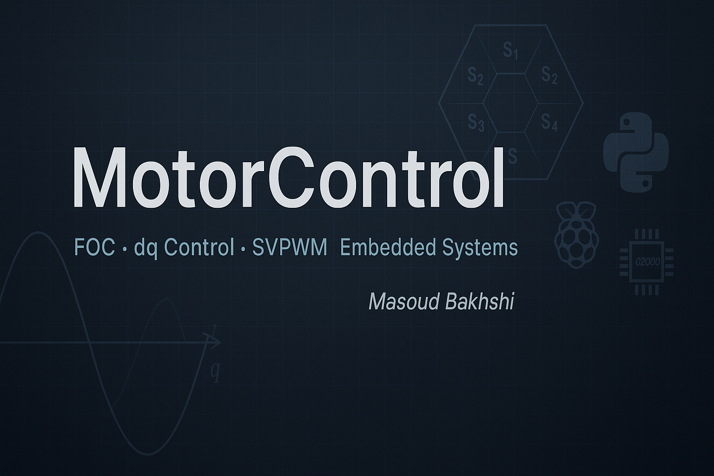

<p align="center">
  
</p>

# 🌀 MotorControl_Simulation

A curated collection of real-world motor control strategies and implementations developed by **Masoud Bakhshi**, Control Software Specialist at Volvo Trucks.

This repository consolidates control logic, simulation models, and experimental setups used for **electric traction systems**, with a strong focus on:

- Field-Oriented Control (FOC)
- dq Current Control
- Adaptive PI Design
- Real-Time Embedded Implementation
- Educational Visualizations of Motor Control Principles

---

## ⚙️ Key Projects

- ✅ **Real-Time dq Current Controller**  
  Closed-loop dq-axis control implemented on Raspberry Pi 4 using live analog input (potentiometers), MOSFET switching, and lamp load feedback. Ideal for educational demos and embedded validation.

- ✅ **SVPWM Visualization Tool**  
  Python-based animated illustrations of SVPWM sectors, switching logic, and overmodulation behavior. Includes waveform analysis and switching sequence tracking.

- ✅ **Clarke & Park Transform Animations**  
  Clear, vector-accurate time-domain representations of abc → αβ → dq transformations. Includes GIFs and MP4s for presentations and teaching.

- ✅ **Adaptive PI Controller with AI Insights**  
  Early-stage ML-tuned PI controller from log data, using measured vs. reference current for gain optimization.

---

## 📂 Repository Structure

```text
MotorControl_Simulation/
├── README.md
├── docs/
│   ├── dq_controller_structure.png
│   └── dq_animation.gif
├── examples/
│   ├── svpwm_visualizer.py
│   └── raspberry_pi_dq_demo/
├── notebooks/
│   └── adaptive_pi_analysis.ipynb
├── src/
│   ├── foc.py
│   ├── svpwm.py
│   ├── clarke_park.py
│   └── pi_controller.py
└── LICENSE 
